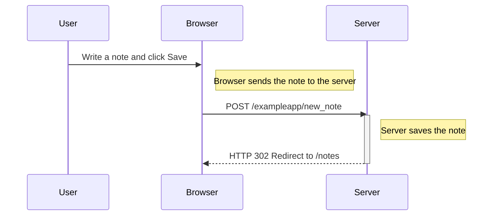

```mermaid
sequenceDiagram

    participant U as User
    participant B as Browser
    participant S as Server

    U->>B: Write a note and click Save
    Note right of B: Browser sends the note to the server

    B->>S: POST /exampleapp/new_note
    activate S
    Note right of S: Server saves the note
    S-->>B: HTTP 302 Redirect to /notes
    deactivate S
```