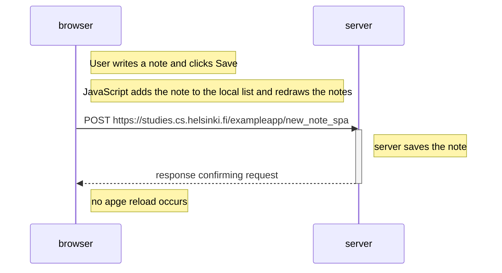

```mermaid
sequenceDiagram
    participant browser
    participant server

    Note right of browser: User writes a note and clicks Save
    Note right of browser: JavaScript adds the note to the local list and redraws the notes

    browser->>server: POST  https://studies.cs.helsinki.fi/exampleapp/new_note_spa
    activate server
    note right of server: server saves the note
    server-->>browser: response confirming request
    deactivate server

    note right of browser: no apge reload occurs
```